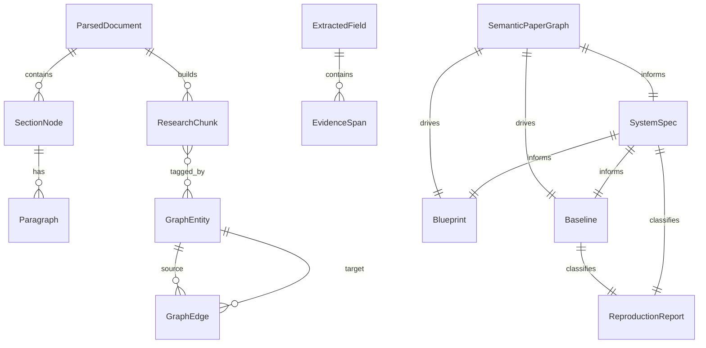

# ATLASS v2 — Data Flow & Artifacts

This document describes **what data exists**, **how it transforms**, and **where it lives**. Use it to explain data lineage in interviews: every downstream artifact must trace to evidence spans.

---

## Data lineage overview

```text
PDF bytes
    │
    ▼
ParsedDocument          (structural — sections, paragraphs, refs)
    │
    ├──────────────────────────────┐
    ▼                              ▼
ResearchMemory              (same parse, chunked)
ResearchChunk[]             paragraph | caption | table | equation | algorithm
    │
    ▼
EvidenceRanker              scores chunks per query/intent
    │
    ▼
ExtractedField × 13         value + supporting_spans + confidence + missing
    │
    ▼
SemanticPaperGraph          GraphEntity[] + GraphEdge[]
    │
    ├──────────────┬──────────────┬──────────────┐
    ▼              ▼              ▼              ▼
system_spec.json  blueprint.json baseline.json  reproduction_report.json
                  (+ DAG view)   (+ project/)   (+ comparability)
```

**Golden rule:** `ExtractedField.supporting_spans` → `GraphEntity.provenance` → spec `source_chunks` → blueprint `evidence_entity_id` → baseline `manifest.evidence_entities`.

---

## Core datatypes (`core/models.py`)

### Provenance

Universal audit pointer:

| Field | Meaning |
|-------|---------|
| `page` | PDF page number |
| `section` | `SectionType` enum (METHOD, EXPERIMENTS, …) |
| `paragraph_id` | Stable ID from section tree |
| `chunk_id` | Research memory chunk |
| `confidence` | Extraction/ranking confidence |
| `citations` | In-text refs (Figure 1, Table 2, …) |

### EvidenceSpan

A **substring of retrieved evidence** bound to provenance. Extractors never return text outside spans.

### ExtractedField

Output of any dedicated extractor:

```json
{
  "value": "We evaluate on GLUE benchmark with RoBERTa.",
  "supporting_spans": [
    {
      "text": "We evaluate on GLUE benchmark with RoBERTa.",
      "provenance": { "page": 1, "section": "experiments", "paragraph_id": "para_3", "chunk_id": "chunk_abc" }
    }
  ],
  "confidence": 0.75,
  "citations": [],
  "missing": false,
  "assumptions": []
}
```

When `missing: true`, `value` is null — downstream must not invent defaults silently.

### ResearchChunk

Permanent memory unit:

| Field | Role |
|-------|------|
| `chunk_id` | Unique key |
| `chunk_type` | `paragraph`, `caption`, `table`, `equation`, `algorithm` |
| `text` | Raw chunk text |
| `section` | Section type for priors |
| `entities` | Graph entity IDs (post `tag_from_graph`) |
| `keywords` | Heuristic terms for overlap scoring |
| `citations` | Extracted ref strings |
| `embedding` | Dense vector (optional, persisted) |

### GraphEntity / GraphEdge

| GraphEntity | GraphEdge types |
|-------------|-----------------|
| `entity_id`, `entity_type`, `text`, `normalized_name`, `provenance`, `confidence` | `uses_dataset`, `evaluates_on`, `improves`, `trained_with`, `compares_against`, `depends_on`, `extends`, `proposes`, `reports` |

Entities are **deduped** by `(entity_type, normalized_name)`.

### ParsedDocument

| Field | Content |
|-------|---------|
| `paper_id` | Stable identifier (often arXiv id) |
| `section_tree` | `SectionNode[]` with hierarchy |
| `paragraphs` | `dict[paragraph_id → text]` |
| `figures`, `tables`, `equations` | Structured refs (extensible) |
| `metadata` | `parser_backend`, `page_count` |

### SectionNode

| Field | Content |
|-------|---------|
| `section_type` | Classified canonical section |
| `paragraph_ids` | Ordered paragraphs in section |
| `figure_refs`, `table_refs`, `equation_refs` | Cross-refs |
| `page_start`, `page_end` | Page span |

---

## Phase-by-phase transformations

### Phase 1 — Parsing

**Input:** PDF file  
**Output:** `ParsedDocument`  
**Path:** `{data_dir}/parsed/{paper_id}/document.json`

**Transformation:**

1. Backend chain: PyMuPDF → pdfplumber (GROBID/Docling scaffolded)
2. Raw pages → `SectionTreeBuilder` (heading regex + `classify_section`)
3. Paragraphs collected with stable IDs
4. Captions/tables/equations detected in section text (later also in memory)

**Data quality signals:** `metadata.parser_backend`, section count, paragraph count.

---

### Phase 5 — Research memory

**Input:** `ParsedDocument`  
**Output:** `ResearchMemory` (chunks + optional FAISS)  
**Path:** `{data_dir}/memory_indices/{paper_id}/`

| File | Content |
|------|---------|
| `chunks.json` | All `ResearchChunk` serialized |
| `embeddings.json` | Chunk embeddings (if built) |
| FAISS index | Vector search backing `DenseScorer` |

**Transformation:**

- One chunk per paragraph (minimum)
- Additional chunks from `chunk_patterns`: captions, tables, equations, algorithms
- `tag_from_graph`: copies entity IDs onto chunks whose text overlaps entity keywords

**Why separate from parse:** Memory is **retrieval-optimized** (typed chunks, embeddings); parse is **structure-optimized** (tree, IDs).

---

### Phase 4 — Evidence ranking

**Input:** Query string + optional `SectionType` filter + `ResearchMemory`  
**Output:** Ranked `ResearchChunk[]` + trace dict

**Trace structure (for debugging):**

```json
{
  "query": "what datasets are used",
  "candidate_count": 42,
  "filtered_by_section": true,
  "ranked": [
    {
      "chunk_id": "chunk_xyz",
      "section": "experiments",
      "score": 2.84,
      "components": {
        "semantic": 0.9,
        "keyword": 1.2,
        "section": 0.95,
        "entity": 0.1,
        "citation": 0.0
      }
    }
  ],
  "cross_encoder_scores": [0.87, 0.72, ...]
}
```

**Interview point:** Decomposable scores enable **offline eval** and **human trust** — black-box top-k is insufficient for research tools.

---

### Phase 3 — Extraction

**Input:** `EvidenceRanker` per extractor  
**Output:** `ExtractedField` per field name

**Registry (`extraction/registry.py`):**

`problem`, `contribution`, `task`, `method`, `architecture`, `loss`, `training`, `evaluation`, `dataset`, `metric`, `baseline`, `limitation`, `future_work`

**Per-extractor flow:**

```text
ranker.retrieve(query, sections=INTENT_SECTIONS[field])
    → evidence_gate.extract_span_bound_sentences(chunks, query_terms)
    → ExtractedField
```

**Evidence gate properties:**

- Sentences must exist verbatim in chunk text
- Optional query-term filter on sentences
- Max 3 sentences default
- No LLM synthesis in current implementation

---

### Phase 2 — Graph build

**Input:** `dict[field_name → ExtractedField]`  
**Output:** `SemanticPaperGraph`  
**Path:** `{data_dir}/knowledge_graphs/{paper_id}/graph.json`

**Transformation:**

1. For each non-missing field → create `GraphEntity` via `FIELD_ENTITY_MAP`
2. Provenance from first `supporting_span`
3. `EDGE_RULES` infer edges when both endpoint entities exist

**Consumption rule:** Blueprint and baseline read **entities**, not re-parse PDF.

---

### Phase 7 — Specification

**Input:** Re-run extractors via `SpecBuilder` (after graph tagging refresh)  
**Output:** `system_spec.json`  
**Path:** `{data_dir}/specifications/{paper_id}/system_spec.json`

```json
{
  "paper_id": "2106.09685",
  "version": 1,
  "fields": {
    "dataset": {
      "value": "...",
      "confidence": 0.75,
      "missing": false,
      "citations": [],
      "assumptions": [],
      "source_chunks": ["chunk_abc"]
    }
  }
}
```

**Reuse validation:** `_validate_no_reuse` — if two fields share identical 200-char prefix, confidence capped and assumption flag added.

---

### Phase 8 — Blueprint

**Input:** `SemanticPaperGraph` + `system_spec`  
**Output:** `blueprint.json`  
**Path:** `{data_dir}/blueprints/{paper_id}/`

**Module record:**

```json
{
  "module": "architecture",
  "file": "src/model/lora.py",
  "evidence_entity_id": "ent_5",
  "confidence": 0.82,
  "provenance": { "page": 1, "section": "SectionType.METHOD" }
}
```

**Flows:** `data_flow`, `training_flow`, `evaluation_flow` from `flow_derivation.py`.

**Versioning:** On save, previous blueprint moved to `blueprint_prev.json` for diff API.

---

### Phase 9 — Baseline

**Input:** Graph + spec  
**Output:** `baseline.json` + `project/` directory  
**Path:** `{data_dir}/baselines/{paper_id}/`

**Supported families:** LORA, TRANSFORMER, MLP, CNN, VIT (`vision_transformer`), DIFFUSION

**Unsupported output:**

```json
{
  "supported": false,
  "family": "gan",
  "message": "Model family 'gan' is not yet supported. Refusing to generate misleading code."
}
```

**Project manifest** (`project/manifest.json`): file list, evidence entity IDs, spec version.

Templates rendered via `template_renderer.py` — parameterized stubs, not LLM-generated code.

---

### Phase 10 — Reproduction report

**Input:** `baseline.json` + `system_spec.json`  
**Output:** `reproduction_report.json`

**Key fields:**

| Field | Meaning |
|-------|---------|
| `level` | `smoke_test` \| `partial` \| `full` |
| `statuses` | EXECUTABLE, DATASET_UNAVAILABLE, METRIC_COMPARABLE, … |
| `metric_comparable` | Boolean — can paper numbers be compared to runs? |
| `comparability_verdict` | Reason + limitations |
| `synthetic_warning` | Never compare smoke metrics to paper |
| `smoke_validation` | `py_compile` on generated project |

---

### Phase 6 — QA (read path, not ingest)

**Input:** Question + loaded `ResearchMemory`  
**Output:** Answer dict

**Success path:** Retrieved chunk text (up to 1500 chars) + provenance + `citation_verified: true`

**Failure path:** `"The paper does not specify."` + `missing_reason` (`low_confidence`, `wrong_section`, `no_retrieval`, …)

---

### Phase 11/15 — Evaluation artifacts

| Artifact | Path | Purpose |
|----------|------|---------|
| Benchmark scores | `benchmark/scores.json` | Time-series regression metrics |
| Golden acceptance | CLI `accept` | 10-paper synthetic PDF suite |

Metrics tracked: extraction accuracy proxies, hallucination rate (field bleed), citation precision, runtime.

---

### Phase 12 — Agent trace

**Path:** `{data_dir}/agent_traces/{paper_id}/trace.json`

```json
{
  "paper_id": "2106.09685",
  "started_at": "...",
  "completed_at": "...",
  "success": true,
  "steps": [
    {
      "agent_name": "document_agent",
      "success": true,
      "output_type": "ParsedDocument",
      "payload_keys": ["paper_id", "section_count", "paragraph_count"],
      "duration_ms": 120.5
    }
  ]
}
```

---

## Entity-relationship diagram (logical)



---

## Idempotency & re-ingest

Re-running `ingest` on same `paper_id`:

- Overwrites artifacts in place
- Blueprint preserves previous version as `blueprint_prev.json`
- Chunk IDs are regenerated (UUID) — **not** content-addressed; re-ingest breaks chunk_id references in external notes

**Interview improvement:** Content-hash chunk IDs or version entire artifact bundle with `ingest_run_id`.

---

## Data volume estimates (back-of-envelope)

| Artifact | Typical size per paper |
|----------|------------------------|
| Parsed document JSON | 50 KB – 2 MB |
| Memory chunks | 100 KB – 5 MB |
| Embeddings + FAISS | 1 – 50 MB (model-dependent) |
| Graph | 10 – 500 KB |
| Spec / blueprint / baseline JSON | 10 – 100 KB |
| Baseline project | 50 – 200 KB |
| Agent trace | 2 – 10 KB |

10k papers → plan object store + vector tier separately from API tier.

---

## Related documents

- [architecture.md](architecture.md) — component layout
- [end_to_end_flow.md](end_to_end_flow.md) — temporal flows
- [interview_deep_dive.md](interview_deep_dive.md) — deep Q&A
