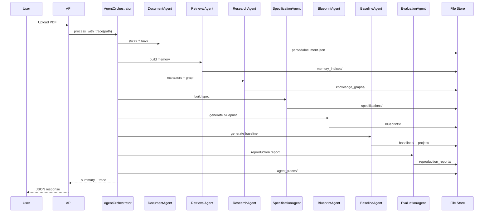
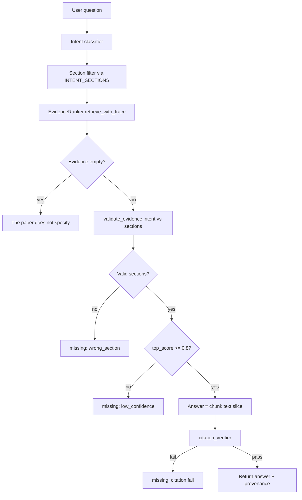

# ATLASS v2 — End-to-End Flows

Step-by-step lifecycles with decision points, failure branches, and API/CLI equivalents. Use this to walk an interviewer through the system without opening the codebase.

---

## Flow 1 — Paper ingest (synchronous)

**Triggers:** `POST /v2/papers/ingest`, `cli ingest`, `AgentOrchestrator.process_with_trace`, `PaperPipeline.ingest`



### Step detail (pipeline equivalent)

| Step | Action | Success criterion | On failure |
|------|--------|-------------------|------------|
| 1 | Parse PDF | `section_count > 0` | Agent trace error; no downstream |
| 2 | Build memory | `chunk_count > 0` | Empty ranker; extractors return missing |
| 3 | Rank + extract ×13 | Spans bound to chunks | Field `missing: true` |
| 4 | Build graph | `entity_count ≥ 0` | Empty graph; blueprint may be unsupported |
| 5 | Tag memory from graph | Entity overlap in ranker | Degraded entity signal |
| 6 | Build spec | 13 fields populated or marked missing | Reuse flags lower confidence |
| 7 | Blueprint | Modules with `evidence_entity_id` when possible | `unsupported` module note |
| 8 | Baseline | `supported` or explicit refusal | No misleading codegen |
| 9 | Reproduction | Level + comparability verdict | Smoke skipped if unsupported |

### Response shape (orchestrator summary)

```json
{
  "paper_id": "2106.09685",
  "section_count": 4,
  "chunk_count": 18,
  "entity_count": 12,
  "edge_count": 3,
  "blueprint_modules": 5,
  "baseline_family": "lora",
  "baseline_supported": true,
  "reproduction_level": "partial",
  "metric_comparable": false,
  "agent_trace_saved": true
}
```

---

## Flow 2 — Paper ingest (async)

**Trigger:** `POST /v2/papers/ingest-async`

```text
Upload PDF → temp file
    → JobQueue.submit(_run)
    → return { job_id, paper_id, status: "pending" }
Background thread:
    → orchestrator.process_with_trace
    → delete temp PDF
    → job status: completed | failed
Poll: GET /v2/jobs/{job_id}
```

**Interview topics:**

- **At-least-once:** No retry logic yet; failed jobs persist error string
- **Durability:** Job status is file-backed; survives process restart but not disk loss
- **Scaling:** Replace with Redis + worker pool; idempotent ingest keyed by `paper_id + pdf_hash`

---

## Flow 3 — Grounded question answering

**Trigger:** `POST /v2/papers/{id}/ask` with `{ "question": "..." }`



### Intent classification (heuristic)

Keyword rules on lowercased question → `dataset`, `metric`, `method`, `problem`, `limitation`, `future_work`, `definition`.

**Not** an LLM classifier in current code — fast, deterministic, auditable.

### Threshold design

`MIN_SCORE_THRESHOLD = 0.8` on composite ranker score (not normalized 0–1 probability). Interviewers may ask: *"How did you calibrate?"* — Answer: benchmark on golden papers + manual retrieval-debug; threshold is conservative to prefer refusal over wrong-section answers.

### Missing response contract

```json
{
  "answer": "The paper does not specify.",
  "confidence": 0.0,
  "missing_reason": "low_confidence",
  "retrieval_score": 0.45,
  "citation_verified": false,
  "trace_summary": { "candidate_count": 18, "cross_encoder_scores": [...] }
}
```

UI can show **why** the system refused — critical for trust.

---

## Flow 4 — Specification review (human in the loop)

**Triggers:** UI or `GET /v2/papers/{id}/spec`, `confidence-heatmap`, `missing-fields`

```text
Load system_spec.json
    → Render per-field value + confidence color
    → Highlight missing_fields list
    → Link source_chunks → evidence viewer
    → Show assumptions (reuse flags, defaults)
```

**Confidence heatmap API:**

```json
{
  "fields": {
    "dataset": { "confidence": 0.75, "missing": false, "has_value": true },
    "training": { "confidence": 0.0, "missing": true, "has_value": false }
  }
}
```

Human reviewer validates spans before trusting blueprint/baseline.

---

## Flow 5 — Blueprint → architecture DAG

**Trigger:** `GET /v2/papers/{id}/architecture-dag`

```text
Load blueprint.json
    → architecture_dag view builder
    → nodes: modules with file paths + evidence_entity_id
    → edges: from data_flow / training_flow sequencing
```

Frontend can render DAG **without filesystem access** to `baselines/project/`.

---

## Flow 6 — Baseline codegen & smoke validation

```text
FamilyDetector.detect() on graph entity text
    → if family in SUPPORTED_FAMILIES:
        template file specs per family
        write_project() → src/, config.yaml, README
        manifest.json with evidence_entity_ids
    else:
        supported: false, no project files

ReproductionEngine.run_smoke():
    if not supported → smoke_skipped
    else py_compile all .py in project/
    → smoke_validation.passed
    → NEVER populate observed_metrics from smoke for comparability
```

**Partial reproduction typical case:** Dataset and method extracted, training hyperparameters missing → `level: partial`, `metric_comparable: false`.

---

## Flow 7 — Agent trace inspection

**Triggers:** `GET /v2/papers/{id}/agent-trace`, `cli agent-trace`

```text
Load agent_traces/{paper_id}/trace.json
    → steps[] with agent_name, duration_ms, success
    → Debug which stage dominated latency (usually retrieval/embeddings)
```

Useful for **SRE** and **demo debugging** — "show your work" for cognition pipeline.

---

## Flow 8 — Retrieval debug

**Trigger:** `GET /v2/papers/{id}/retrieval-debug?q=...`

```text
Load memory → EvidenceRanker → retrieve_with_trace(q)
    → Return full ranked list + score components
```

Offline eval loop: compare expected chunk_id in top-k for golden queries.

---

## Flow 9 — Benchmark regression (CI)

**Triggers:** `POST /v2/benchmark/smoke`, `cli benchmark`

```text
make_lora_sample_document()  # synthetic, no PDF
    → memory + ranker (cross_encoder disabled for speed)
    → DatasetExtractor + ProblemExtractor section checks
    → SpecBuilder fields_distinct check
    → hallucination_rate proxy
    → append ScoreStore timestamped entry
```

Runs in < 5 minutes smoke subset — designed for CI gate.

---

## Flow 10 — Golden paper acceptance

**Trigger:** `cli accept`

```text
For each of 10 arXiv ids:
    → synthesize PDF from GOLDEN_PROFILES text
    → PaperPipeline.ingest
    → checks:
        ingested
        fields_distinct (dataset ≠ problem)
        dataset_has_evidence
        blueprint_has_modules (with evidence_entity_id)
        baseline_ok (family match rules)
        no_contradictory_missing (value + missing both true)
    → aggregate all_passed
```

Exit code 1 if any paper fails — suitable for release gate.

---

## Flow comparison — v1 vs v2 ingest

| Stage | v1 (typical RAG) | v2 |
|-------|------------------|-----|
| Parse | Optional / shallow | Required structural tree |
| Index | Flat chunks | Typed multi-chunk memory |
| Extract | One LLM prompt | 13 gated extractors |
| Structure | None | Graph + spec |
| Codegen | Generic template | Family-gated templates |
| QA | LLM synthesis | Retrieve + validate + refuse |
| Audit | Poor | Traces + provenance everywhere |

---

## Latency budget (single paper, local)

| Stage | Typical |
|-------|---------|
| Parse | 0.1–2 s |
| Memory + embeddings | 1–10 s |
| Extractors ×13 + graph | 2–15 s |
| Spec + blueprint + baseline | 0.5–2 s |
| Smoke compile | 0.1–0.5 s |
| **Total** | ~5–30 s (embedding model load dominates cold start) |

Cross-encoder adds network/model latency; falls back gracefully.

---

## Related documents

- [architecture.md](architecture.md)
- [data_flow.md](data_flow.md)
- [interview_deep_dive.md](interview_deep_dive.md)
